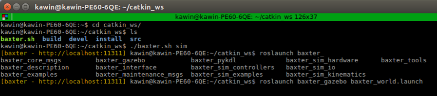

DE VITO: A Dual-arm, High Degree-of-freedom, Lightweight, Inexpensive, Passive Upper-limb Exoskeleton for Robot Teleoperation
=============================================================================================================================

This repository contains the joint and Cartesian space kinematic control algorithms for DE VITO, a seven degree-of-freedom, dual-arm upper-limb exoskeleton that passively measures the pose of a human arm. DE VITO is a lightweight, simplistic and energy-efficient design with a total material cost of at least an order of magnitude less than previous work. Furthermore, we provide the a paper discussing the technical implementation, the CAD models and supplementary videos of DE VITO at http://www.imperial.ac.uk/robot-intelligence/robots/de_vito/ and below:

* Paper: https://link.springer.com/book/10.1007/978-3-030-23807-0
* CAD models for 3D printing and laser cutting: https://drive.google.com/drive/folders/1BpmI3DLC9pfB2qu1H0x3XeXltqMBz4HW?usp=sharing
* Videos: TODO

<!--  -->

This code was written, edited and documented by:

* Kawin Larppichet (Imperial College London, Robot Intelligence Lab)
* Fabian Falck (Imperial College London, Robot Intelligence Lab)

For correspondence on this project, please open an Issue on Github.

Citation
--------

TODO

Overview
--------

The following table provides an overview on the files provided in this project.

| File name                  | Description                                                                                                                                                                                 |
| -------------------------- |:-------------------------------------------------------------------------------------------------------------------------------------------------------------------------------------------:|
| exoskeleton_reader.py      | Initializes a ROS node `Exoskeleton` that publishes exoskeleton readings as custom ROS messages, specified in exoskeleton.msg, on the topic `exo_info`.                                     |
| teleoperation_baxter.py    | Initializes a ROS node `teleoperation` that is subscribed to the published messages on topic `exo_info` of `Exoskeleton` and controls the Baxter arms in a selected kinematic control mode. |
| exo_info.msg               | ROS custom message specification, as streamed on the topic `exo_info`.                                                                                                                      |
| exo_read.ino               | Arudiono code TODOKawin                                                                                                                                                                     |

Hardware requirements
---------------------

* DE VITO Exoskeleton
* Baxter Robot
* Desktop/Laptop machine (running Ubuntu 16.04)

Software requirements
---------------------

In the following, we provide a list of software, libraries and packages are required for execution of the kinematic control scripts of DE VITO. The system was tested in this exact configuration, although other configurations might work, too.

General:

* Ubuntu 16.04
* ROS Kinetic (http://wiki.ros.org/kinetic)
* Baxter SDK (http://sdk.rethinkrobotics.com/wiki/Workstation_Setup)
* Python 2.7

Python packages:

* Pyserial (https://pypi.org/project/pyserial/)
* Times (https://pypi.org/project/times/)
* Numpy (https://scipy.org/install.html)
* Math

Step-by-step instructions on how to teleoperate DE NIRO with DE VITO
--------------------------------------------------------------------

First, connect the exoskeleton to the Ubuntu machine via USB cable. The USB connection port can be found by executing `ls /dev` on the terminal, comparing the output before and after plugging. An exemplary output is on the image below. Typically, this will show something similar to `/dev/tty/ACM0`, depending on the order when you plug USB devices to the computer.

Then, open another terminal window and change the permissions of this USB device so that the computer can communicate to it. Assuming the device was identified as `/dev/tty/ACM0`, execute `sudo chmod a+rw /dev/ttyACM0` and enter your user password when prompted.

The USB device (exoskeleton) is now all set up!

The system for teleoperating Robot DE NIRO (Baxter arms) can run either through the Gazebo simulation environment or the physical robot. On the terminal, navigate to the directory of your Catkin workspace where `Baxter.sh` is located (e.g. `cd ~/catkin_ws`). If you choose to use DE VITO for teleoperation while running DE NIRO in simulation, run `./baxter.sh sim`; for running it on the physical robot, execute `./baxter.sh`.

Simulation only: If you chose to run DE NIRO in simulation, you require one additional step: In the terminal in which you just executed the `baxter.sh` file, execute `roslaunch baxter_gazebo baxter_world.launch` to launch the Gazebo simulation environment.

All initialization work is done now and we are good to go for starting the teleoperation node! For all following screenshots, we assume that you are currently running DE VITO in simulation. Start reading the sensor data from the exoskeleton by running `rosrun exoskeleton exoskeleton_reader`.

Finally, start publishing the sensor readings by executing `rosrun exoskeleton teleoperation_baxter.py`.

If you followed the above steps correctly, your screen should successfully look similar to below and you should be able to teleoperate DE NIRO!

Congratulations! Enjoy your new superhuman capabilities of teleoperating Robot DE NIRO!

Mode of kinematic control
-------------------------

As outlined in detail in the paper, we implemented two algorithms of kinematic control for DE VITO:

1) joint space mapping
2) Cartesian space (end-effector) mapping

All parameters that can be adjusted and were tuned for both kinematic algorithms are in `teleoperation_baxter.py` and there explained in detail in the comments. Changing the parameter `mode` allows to switch between the two kinematic control algorithms. For joint space mapping, the main parameters are the scalar multipliers in angle mapping functions `r_exo_baxter_map_ex(angles)` and `l_exo_baxter_map(angles)` which allow separate tuning for each arm. In the cartesian mapping algorithm, we give two fixed postures that define the last degree of freedom which can be selected by changing the parameter `mode` to `2` or `3`, respectively. For details, refer to the comments in the python script.

